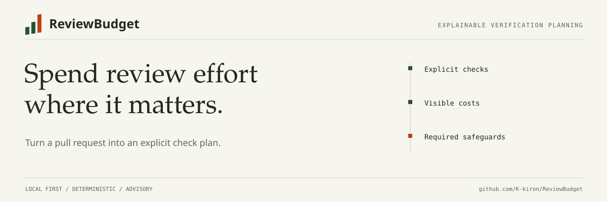

# ReviewBudget

**Give every pull request a verification plan that fits your review budget.**

[](https://github.com/K-kiron/ReviewBudget/actions/workflows/ci.yml)
[](pyproject.toml)
[](LICENSE)



Some changes need a quick check. Others need integration tests, a security review, and a rollback plan. ReviewBudget turns a Git diff or GitHub PR into **named checks, explicit costs, missing evidence, and reasons**. It also allocates one budget across a queue of PRs.

Runs locally. No account, service, or runtime dependencies. Produces a portable HTML report you can open offline. Existing required checks stay required, even when the budget is too small.

## Try it in a minute

Requires Python 3.11+ and Git. Install the development preview into an isolated environment:

```bash
python -m venv .venv
# Linux/macOS: source .venv/bin/activate
# Windows PowerShell: .venv\Scripts\Activate.ps1
python -m pip install "git+https://github.com/K-kiron/ReviewBudget.git@dev"
reviewbudget demo --format html --output demo.html
```

Open `demo.html` in your browser. Switch between documentation, tested code, authorization, migration, and incomplete-input examples. Expand a check to see why it was selected. Everything works offline, including importing your own JSON report.

**Before this preview is merged into `dev`, install its PR branch:** replace `@dev` with `@feat/8-public-preview`. There is no package-registry release yet. Installation from a release wheel is documented in [releases](docs/releases.md).

Prefer a terminal? Run `reviewbudget demo`. Examples and policies are included in the installed package; you do not need a repository checkout or token.

## Use it on your change

From your own Git repository:

```bash
reviewbudget init --preset python  # or --preset node
# Edit .reviewbudget.toml to name your real checks and supply their costs.
reviewbudget analyze --base main --policy .reviewbudget.toml
reviewbudget analyze --base main --policy .reviewbudget.toml --format html --output review.html
```

Local analysis compares **committed changes since the merge base**. Uncommitted edits are excluded. It does not execute your code, hooks, diff helpers, or test commands. `init` never overwrites an existing policy.

Analyze a GitHub PR using an existing GitHub CLI login:

```bash
reviewbudget analyze OWNER/REPO#123 --auth gh --policy .reviewbudget.toml
```

Or use `GITHUB_TOKEN` / `GH_TOKEN` with the default authentication mode. Public PRs also work without authentication, within GitHub's API limits. Tokens are never report fields or command arguments.

Save multiple reports and allocate a shared budget:

```bash
reviewbudget analyze OWNER/REPO#123 --auth gh --policy .reviewbudget.toml --format json --output first.json
reviewbudget analyze OWNER/REPO#124 --auth gh --policy .reviewbudget.toml --format json --output second.json
reviewbudget allocate --input first.json --input second.json --budget-minutes 60 --format html --output queue.html
```

## What you get

| Output | What it tells you |
| --- | --- |
| Verification floor | The minimum recommended capabilities for this change, from lint to intensive review |
| Named checks | Your configured jobs or review activities, selected, deferred, or not applicable |
| Budget accounting | Declared check minutes, mandatory shortfall, unknown prices, and unmapped capabilities |
| Evidence gaps | Missing testing, reproduction, compatibility, migration, or rollout information |
| Reasons and provenance | Relevant paths, source commits, policy fingerprint, and input limitations |

A tiny authorization change still needs intensive review. A missing patch is uncertainty, not a free pass. If required work costs 107 declared minutes and the budget is 45, the report shows the **62-minute shortfall** and keeps that work selected.

The bundled policy gives the documentation example 2 selected minutes versus a 115-minute full configured suite. Those numbers are **illustrative configuration**, not observed savings. The full baseline includes all configured checks, including checks that would not apply to the changed paths. Check minutes add together; they are not elapsed time or reviewer availability.

## Map the plan to your checks

```toml
sensitive_paths = ["src/payments/*"]

[budget]
limit_minutes = 30

[[checks]]
id = "lint"
name = "Formatting and lint"
covers = ["format_and_lint"]
required = true
estimated_minutes = 2

[[checks]]
id = "unit"
name = "Unit tests"
covers = ["unit_tests"]
paths = ["src/*", "tests/*"]
estimated_minutes = 5
priority = 20
```

This abbreviated policy does not map every capability; the report will say so. Start with `init` for a complete Python or Node template. Replace illustrative costs with your own estimates, or omit prices when unknown. A mapping declares intent; it does not establish that a job really covers a behavior or has passed.

[Policy reference](docs/policy.md) · [GitHub Actions recipe](docs/github-actions.md) · [Report format](docs/report-format.md) · [CLI and troubleshooting](docs/usage.md)

## Where it fits

| Approach | Useful for | ReviewBudget adds |
| --- | --- | --- |
| Always run every check | A simple, conservative default | A visible plan for optional spending and manual review priorities |
| [paths-filter](https://github.com/dorny/paths-filter) | Matching changed paths to jobs | Verification floors, evidence gaps, priced checks, and a shared PR budget |
| [reviewdog](https://github.com/reviewdog/reviewdog) | Presenting analyzer diagnostics in code review | Planning which verification activities need attention before executing them |

ReviewBudget does not replace analyzers, test runners, reviewers, or branch protection. It plans work; it does not execute checks or approve merges.

## Evidence and limits

Version 0.2 is a usable **advisory public preview**. Routing is deterministic and explainable, not a trained defect predictor. Description evidence is self-reported; path matching does not understand program semantics. English Markdown evidence headings are currently supported.

[The reproducible evaluation](docs/evaluation.md) reports results on public PRs, the change-size baseline, sample selection, and eligibility limits. Final-state history cannot prove pre-review prediction quality. No claim of measured time savings, defect reduction, or superiority over the baseline is made.

To build prospective evidence, save an original snapshot before review, then join it with eventual outcomes. The collector supports checkpointed resume without changing the chosen PR cohort:

```bash
reviewbudget capture OWNER/REPO#123 --auth gh --output snapshots/pr-123.json
reviewbudget collect OWNER/REPO --auth gh --limit 100 --output history.local.jsonl
# After an interrupted collection:
reviewbudget collect OWNER/REPO --auth gh --limit 100 --output history.local.jsonl --resume
reviewbudget evaluate --input history.local.jsonl --snapshots snapshots --output evaluation.json
```

A capture is marked pre-review only while the PR is open and no submitted reviews are observed. The evaluator checks observation and outcome times again. Preserve original snapshots; do not replace them with final-state captures.

## Contribute

See [CONTRIBUTING.md](CONTRIBUTING.md) for development, tests, and useful bug reports. [SECURITY.md](SECURITY.md) describes trust boundaries. [CHANGELOG.md](CHANGELOG.md) lists changes. [Release instructions](docs/releases.md) cover verified artifacts and the offline demo.

MIT licensed. Built and maintained by [Wenhao XU](https://github.com/K-kiron).
